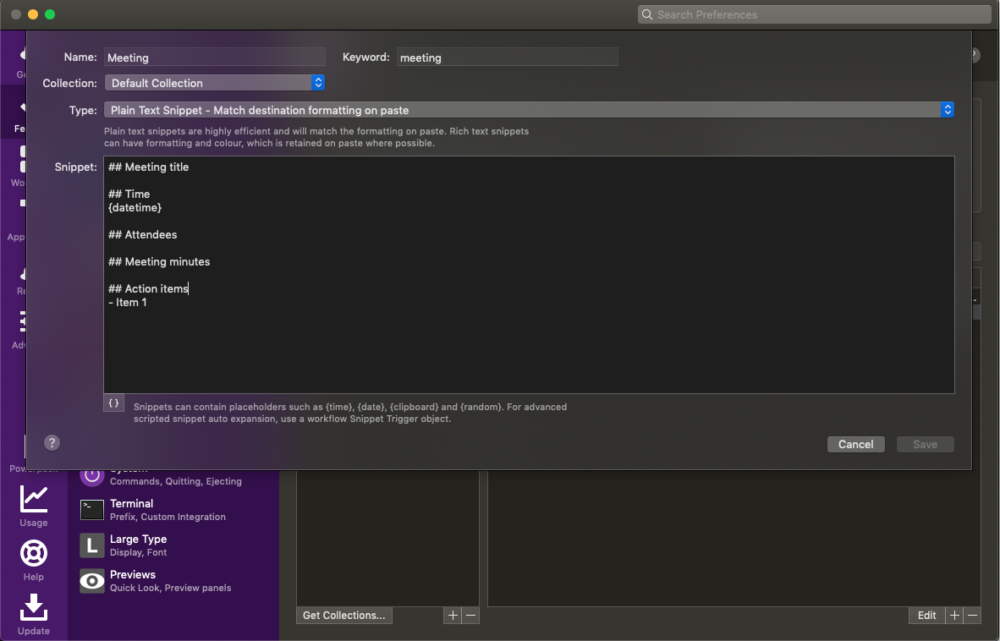
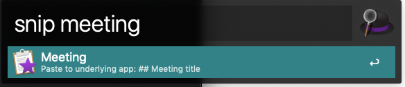
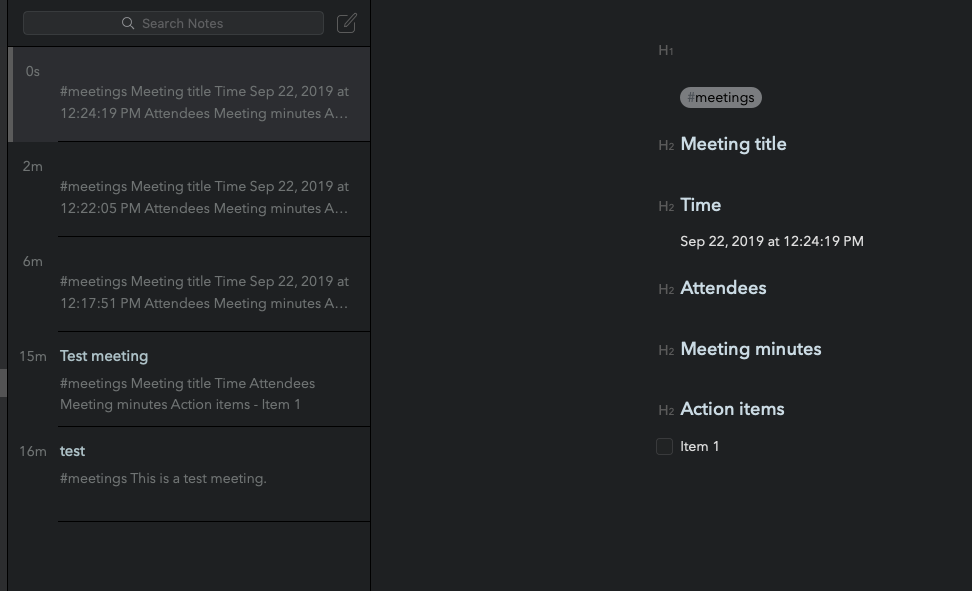

I am a big fan of Bear and for me, the much-desired feature is support for templates. So while the Bear team works on it, here’s a workaround with Alfred.

First you will need to create a snippet in Alfred. To do that, go to Alfred Preferences > Features > Snippets and create a new one with the following markdown code:

```
## Meeting title  

## Time {datetime}  

## Attendees   

## Meeting minutes  

## Action items 
    - Item 1
```

Alfred supports dynamic content, so {datetime} would render the current date and time. You may also add in hashtags and such. Once you are done, you will probably end up with something like this:



Save that, close the Alfred Preferences window and go back to Bear. In Bear, create a new note, bring up the Alfred search bar using Option + Space (default setting) and type in snip meeting.



Make sure your Bear note is in focus when you run the above command. Alfred will then paste your meeting snippet into your Bear note.



Ofcourse this is not restricted to just Bear. You could use this Alfred function with pretty much any app.

Happy note taking!