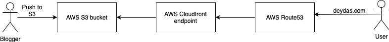
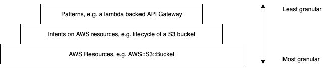

If you plan to deploy your static website on AWS resources and want to create those resources using the new AWS CDK, this blog post is just the thing for you. 

We will use the following deployment workflow for the purposes of this post. I want to keep it simple on purpose, so we can focus more on the CDK code rather than the complexity of the deployment pipeline.



Thus we need to create the following AWS resources:
1. A S3 bucket.
2. A Cloudfront distribution.
3. A route 53 hosted zone.
4. And a SSL certificate if we want to serve HTTPS traffic.

AWS has some [documentation](https://docs.aws.amazon.com/cdk/latest/guide/getting_started.html) on how to get started, the TLDR of which for our purposes is:

1. If not already installed, install the AWS CDK CLI
```
npm install -g aws-cdk
cdk --version
```
2. Create and initialize the app (an app is a collection of stacks)
```
mkdir hello-cdk
cd hello-cdk
cdk init --language JAVA
```
3. If you want to see what stacks were created, use
```
cdk ls
```

# Diving deep into the generated code
The code generated in the previous step comes with just two classes:
1. HelloCdkApp and
2. HelloCdkStack

In this section we will dive a little deepeer into the concepts that make the AWS CDK.

## Constructs
A construct could be a AWS resource at its most granular and can be a pattern at its least granular level. In general, a construct can be thought of as a container that encapsulates everything AWS Cloudformation needs to create a component. If we were to draw a pyramid of what a construct could look like at different levels of granularity,


## Stacks and apps
There are a couple of other concepts orthogonal to Constructs. As you can imagine, a typical infrastructure project will have a hierarchy of constructs, one nested within another, all rolling up to a root construct. That root construct is called an **App**.

A **Stack** on the other hand, is defined as an unit of deployment, analogous to a Cloudformation stack. A Stack may contain resources or other higher level Constructs.

## The generated code
```java
public class HelloCdkApp {
    public static void main(final String argv[]) {
        App app = new App();

        new HelloCdkStack(app, "HelloCdkStack");

        app.synth();
    }
}
```
```java
public class HelloCdkStack extends Stack {
    public HelloCdkStack(final Construct scope, final String id) {
        super(scope, id, null);

        // The code that defines your stack goes here
    }
}
```
The boiler plate code starts with the two concepts of Stacks and Apps, with HelloCdkApp synthesizing (`.synth()`) HelloCdkStack. The Construct for HelloCdkStack stack is the root, aka, the App. The id `HelloCdkStack` is the id for the App Construct. Simple and straight-forward!

# Building the App for our static website
Keeping the boiler plate code as a starting point, in this section we will go about building out the CDK based App for our static website.

## Breaking down the constructs
Going back to the first section, these are the resources we need for our static website:
1. A S3 bucket -- containing the static website files.
2. A Cloudfront distribution -- fronting the S3 bucket in #1. We would also need to invalidate the Cloudfront cache when new files are uploaded to the S3 bucket.
3. A route 53 hosted zone -- containing records for the public facing domain and routing information to call the Cloudfront endpoint in #2.
4. And a SSL certificate if we want to serve HTTPS traffic -- that is served by the Cloudfront distribution in #2.

We will use the [AWS CDK API reference](https://docs.aws.amazon.com/cdk/api/latest/docs/aws-construct-library.html) to re-use as many Constructs as possible. To start with, the boiler plate code produces the following *empty* template:

```json
{ }
```

### Setting up the deployment environment
AWS CDK is environment-agnostic for deployments. By default, the CDK will use the AWS CLI profile (or the default profile if none is specified). For production environments though, like the one we have, it probably makes more sense to pen the environments down in code.

There are probably a couple of ways to do that. We could get the environments at synthesis time using environment variables or have them hardcoded. The first makes a lot of sense if we had a pipeline with multiple stages of deployment. But we don't. So we are going to use the second approach.

```java
private static Environment makeEnv(String account, String region) {
    account = (account == null) ? System.getenv("CDK_DEFAULT_ACCOUNT") : account;
    region = (region == null) ? System.getenv("CDK_DEFAULT_REGION") : region;

    return Environment.builder()
            .account(account)
            .region(region)
            .build();
  }
```
```java
public static void main(final String argv[]) {
    App app = new App();

    Environment envUSA = makeEnv(ACCOUNT_ID, DEPLOYMENT_REGION);

    new BlogCdkStack(app, "BlogCdkStack", StackProps.builder()
            .env(envUSA).build());

    app.synth();
  }
```

### Creating a S3 bucket
[This](https://docs.aws.amazon.com/cdk/api/latest/docs/@aws-cdk_aws-s3.Bucket.html) is the construct to create a S3 bucket:
```java
new Bucket(scope: Construct, id: string, props?: BucketProps)
```
* Construct -- refers to any abstraction it will be scoped under (refer the Constructs section above).
* id -- logical id for the bucket.
* props (*optional*) -- additional properties for the bucket.

Since props is optional, let's start with the basics.

```java
public class BlogCdkStack extends Stack {
  public BlogCdkStack(final Construct scope, final String id) {
    super(scope, id, null);

    new Bucket(this, "deydas.com");
  }
}
```

This scopes it to the `BlogCdkStack` and creates a S3 bucket with a, unique in the stack, logical id `deydas.com`. This would generate the following template:
```json
{
  "Resources" : {
    "deydascomB5318F7E" : {
      "Type" : "AWS::S3::Bucket",
      "UpdateReplacePolicy" : "Retain",
      "DeletionPolicy" : "Retain"
    }
  }
}
```

But we would also want the bucket contents to be publicly accessible since it's a public facing website. And also name the bucket. The first one is an intent (*ref Pyramid of constructs*) and the second a property. Since the first one is an intent, the AWS SDK provides a couple of ways to set it: 

1. Set it as part of the properties factmap.

```java
public class BlogCdkStack extends Stack {

  private static final String WEBSITE_BUCKET_NAME = "deydas.com";

  public BlogCdkStack(final Construct scope, final String id) {
    super(scope, id, null);

    final BucketProps bucketProps = BucketProps.builder()
            .publicReadAccess(true)
            .bucketName(WEBSITE_BUCKET_NAME)
            .build();
    final Bucket websiteS3Bucket = new Bucket(this, WEBSITE_BUCKET_NAME, bucketProps);
  }
}
```

2. Set it as an intent on the bucket resource.

```java
private void createWebsiteBucket() {
    final BucketProps bucketProps = BucketProps.builder()
            .bucketName(WEBSITE_BUCKET_NAME)
            .build();
    final Bucket websiteS3Bucket = new Bucket(this, WEBSITE_BUCKET_NAME, bucketProps);
    websiteS3Bucket.grantPublicAccess("*");
}
```

I prefer the second method because it clarifies the distinction between setting a property and setting an intent.

The public access intent along with the bucket name would generate the following template:

```json
{
  "Resources" : {
    "deydascomB5318F7E" : {
      "Type" : "AWS::S3::Bucket",
      "Properties" : {
        "BucketName" : "deydas.com"
      },
      "UpdateReplacePolicy" : "Retain",
      "DeletionPolicy" : "Retain"
    },
    "deydascomPolicy1F48E2F7" : {
      "Type" : "AWS::S3::BucketPolicy",
      "Properties" : {
        "Bucket" : {
          "Ref" : "deydascomB5318F7E"
        },
        "PolicyDocument" : {
          "Statement" : [ {
            "Action" : "s3:GetObject",
            "Effect" : "Allow",
            "Principal" : "*",
            "Resource" : {
              "Fn::Join" : [ "", [ {
                "Fn::GetAtt" : [ "deydascomB5318F7E", "Arn" ]
              }, "/*" ] ]
            }
          } ],
          "Version" : "2012-10-17"
        }
      }
    }
  }
}
```

### Creating the SSL certificate
Before creating the distribution, we will need to create a SSL certificate. For this blog, I am going to go with a certificate from Amazon Certificate Manager (ACM). We will need to choose the following in order to do so:

1. The domain name the certificate will be for, e.g., deydas.com.
2. The alternative names the certificate will be for, e.g., www.deydas.com, foo.deydas.com, etc.
3. The validation method: DNS or email.

```java
private void createAcmCertificate() {
    final CertificateProps certificateProps = CertificateProps.builder()
            .domainName(SSL_CERTIFICATE_DOMAIN_NAME)
            .subjectAlternativeNames(SSL_CERTIFICATE_SUB_DOMAINS)
            .validationMethod(ValidationMethod.DNS)
            .build();
    new Certificate(this, SSL_CERTIFICATE_ID, certificateProps);
}
```

All of those can be set as part of the properties factmap. I am not sure why the validation method is not an intent though. Please let me know if you know why.

Now the template becomes:
```json
{
  "Resources" : {
    "deydascombucket5732865D" : {
      "Type" : "AWS::S3::Bucket",
      "Properties" : {
        "BucketName" : "deydas.com-bucket"
      },
      "UpdateReplacePolicy" : "Retain",
      "DeletionPolicy" : "Retain"
    },
    "deydascombucketPolicy29120D0D" : {
      "Type" : "AWS::S3::BucketPolicy",
      "Properties" : {
        "Bucket" : {
          "Ref" : "deydascombucket5732865D"
        },
        "PolicyDocument" : {
          "Statement" : [ {
            "Action" : "s3:GetObject",
            "Effect" : "Allow",
            "Principal" : "*",
            "Resource" : {
              "Fn::Join" : [ "", [ {
                "Fn::GetAtt" : [ "deydascombucket5732865D", "Arn" ]
              }, "/*" ] ]
            }
          } ],
          "Version" : "2012-10-17"
        }
      }
    },
    "deydascomcertificate31819D1B" : {
      "Type" : "AWS::CertificateManager::Certificate",
      "Properties" : {
        "DomainName" : "deydas.com",
        "DomainValidationOptions" : [ {
          "DomainName" : "deydas.com",
          "ValidationDomain" : "deydas.com"
        }, {
          "DomainName" : "*.deydas.com",
          "ValidationDomain" : "deydas.com"
        } ],
        "SubjectAlternativeNames" : [ "*.deydas.com" ],
        "ValidationMethod" : "DNS"
      }
    }
  }
}
```

### Creating the Cloudfront distribution
The AWS documentation for creating a cloudfront distribution using the AWS CDK is [here](https://docs.aws.amazon.com/cdk/api/latest/docs/aws-cloudfront-readme.html).

We get the viewer certificate from ACM, attach the bucket we created earlier as the origin, define the logging bucket and price class we want for the distribution and that's about it. We will also need to mention the domains we want to access this distribution with, e.g. deydas.com and www.deydas.com.

```java
private CloudFrontWebDistribution createCloudfrontDistribution(final Certificate acmCertificate,
                                                                 final Bucket websiteBucket) {
    final ViewerCertificateOptions viewerCertificateOptions = ViewerCertificateOptions.builder()
            .aliases(ImmutableList.of(ROUTE_53_ZONE_NAME, String.format("www.%s", ROUTE_53_ZONE_NAME)))
            .build();
    final ViewerCertificate viewerCertificate = ViewerCertificate.fromAcmCertificate(acmCertificate, viewerCertificateOptions);

    final S3OriginConfig s3OriginConfig = S3OriginConfig.builder()
            .s3BucketSource(websiteBucket)
            .build();
    final List<Behavior> behaviorList = ImmutableList.of(Behavior.builder().isDefaultBehavior(true).build());
    final SourceConfiguration sourceConfiguration = SourceConfiguration.builder()
            .s3OriginSource(s3OriginConfig)
            .behaviors(behaviorList)
            .build();

    final LoggingConfiguration loggingConfiguration = LoggingConfiguration.builder()
            .bucket(createCloudfrontLoggingBucket())
            .includeCookies(false)
            .build();

    final CloudFrontWebDistributionProps cloudFrontWebDistributionProps = CloudFrontWebDistributionProps.builder()
            .viewerCertificate(viewerCertificate)
            .originConfigs(ImmutableList.of(sourceConfiguration))
            .loggingConfig(loggingConfiguration)
            .priceClass(PriceClass.PRICE_CLASS_ALL)
            .defaultRootObject("index.html")
            .viewerProtocolPolicy(ViewerProtocolPolicy.REDIRECT_TO_HTTPS)
            .build();

    return new CloudFrontWebDistribution(this, CLOUD_FRONT_DISTRIBUTION_ID, cloudFrontWebDistributionProps);
  }

  private Bucket createCloudfrontLoggingBucket() {
    final BucketProps bucketProps = BucketProps.builder()
            .bucketName(CLOUD_FRONT_LOGGING_BUCKET_NAME)
            .build();
    return new Bucket(this, CLOUD_FRONT_LOGGING_BUCKET_NAME, bucketProps);
  }
```

That adds the following configuration to our template:
```json
"deydascomcloudfrontlogs0EEEAE65" : {
      "Type" : "AWS::S3::Bucket",
      "Properties" : {
        "BucketName" : "deydas.com-cloudfront-logs"
      },
      "UpdateReplacePolicy" : "Retain",
      "DeletionPolicy" : "Retain"
    },
    "deydascomcloudfrontCFDistribution31EC1082" : {
      "Type" : "AWS::CloudFront::Distribution",
      "Properties" : {
        "DistributionConfig" : {
          "Aliases" : [ ],
          "DefaultCacheBehavior" : {
            "AllowedMethods" : [ "GET", "HEAD" ],
            "CachedMethods" : [ "GET", "HEAD" ],
            "Compress" : true,
            "ForwardedValues" : {
              "Cookies" : {
                "Forward" : "none"
              },
              "QueryString" : false
            },
            "TargetOriginId" : "origin1",
            "ViewerProtocolPolicy" : "redirect-to-https"
          },
          "DefaultRootObject" : "/",
          "Enabled" : true,
          "HttpVersion" : "http2",
          "IPV6Enabled" : true,
          "Logging" : {
            "Bucket" : {
              "Fn::GetAtt" : [ "deydascomcloudfrontlogs0EEEAE65", "RegionalDomainName" ]
            },
            "IncludeCookies" : false
          },
          "Origins" : [ {
            "DomainName" : {
              "Fn::GetAtt" : [ "deydascombucket5732865D", "RegionalDomainName" ]
            },
            "Id" : "origin1",
            "S3OriginConfig" : { }
          } ],
          "PriceClass" : "PriceClass_All",
          "ViewerCertificate" : {
            "AcmCertificateArn" : {
              "Ref" : "deydascomcertificate31819D1B"
            },
            "SslSupportMethod" : "sni-only"
          }
        }
      }
    }
```

### Creating the Route53 hosted zone
We will need to 
1. Create a hosted zone for `deydas.com` so we could point the domain from our registrar to the AWS nameservers.
2. Create an `A record` pointing to the Cloudfront distribution alias.
3. Create a `CNAME record` for `www.deydas.com` pointing to `deydas.com`.

```java
private void createRoute53HostedZone(final CloudFrontWebDistribution cloudFrontWebDistribution) {
    final PublicHostedZoneProps publicHostedZoneProps = PublicHostedZoneProps.builder()
            .zoneName(ROUTE_53_ZONE_NAME)
            .build();

    final PublicHostedZone publicHostedZone = new PublicHostedZone(this, ROUTE_53_ID, publicHostedZoneProps);

    final RecordTarget recordTarget = RecordTarget.fromAlias(new CloudFrontTarget(cloudFrontWebDistribution));
    final ARecordProps aRecordProps = ARecordProps.builder()
            .recordName(SSL_CERTIFICATE_DOMAIN_NAME)
            .target(recordTarget)
            .zone(publicHostedZone)
            .build();
    new ARecord(this, ROUTE_53_DOMAIN_A_RECORD_ID, aRecordProps);

    final CnameRecordProps cnameRecordProps = CnameRecordProps.builder()
            .domainName(SSL_CERTIFICATE_DOMAIN_NAME)
            .recordName("www")
            .zone(publicHostedZone)
            .build();
    new CnameRecord(this, ROUTE_53_DOMAIN_CNAME_RECORD_ID, cnameRecordProps);
  }
```

That adds the following to our template:

```json
"deydascomdomainarecordECB5C56B" : {
      "Type" : "AWS::Route53::RecordSet",
      "Properties" : {
        "Name" : "deydas.com.",
        "Type" : "A",
        "AliasTarget" : {
          "DNSName" : {
            "Fn::GetAtt" : [ "deydascomcloudfrontCFDistribution31EC1082", "DomainName" ]
          },
          "HostedZoneId" : "Z2FDTNDATAQYW2"
        },
        "HostedZoneId" : {
          "Ref" : "deydascomroute53D04BCAFF"
        }
      }
    },
    "deydascomdomainawwwrecordC44DCA5B" : {
      "Type" : "AWS::Route53::RecordSet",
      "Properties" : {
        "Name" : "www.deydas.com.",
        "Type" : "CNAME",
        "HostedZoneId" : {
          "Ref" : "deydascomroute53D04BCAFF"
        },
        "ResourceRecords" : [ "deydas.com" ],
        "TTL" : "1800"
      }
    }
  }
```

### Deploying with the CDK CLI
1. Synthesize using `cdk synthesize`. That should output the YAML template for the stack.
```yaml
Resources:
  deydascombucket5732865D:
    Type: AWS::S3::Bucket
    Properties:
      BucketName: deydas.com-bucket
    UpdateReplacePolicy: Retain
    DeletionPolicy: Retain
    Metadata:
      aws:cdk:path: BlogCdkStack/deydas.com-bucket/Resource
  deydascombucketPolicy29120D0D:
    Type: AWS::S3::BucketPolicy
    Properties:
      Bucket:
        Ref: deydascombucket5732865D
      PolicyDocument:
        Statement:
          - Action: s3:GetObject
            Effect: Allow
            Principal: "*"
            Resource:
              Fn::Join:
                - ""
                - - Fn::GetAtt:
                      - deydascombucket5732865D
                      - Arn
                  - /*
        Version: "2012-10-17"
    Metadata:
      aws:cdk:path: BlogCdkStack/deydas.com-bucket/Policy/Resource
  deydascomcertificate31819D1B:
    Type: AWS::CertificateManager::Certificate
    Properties:
      DomainName: deydas.com
      DomainValidationOptions:
        - DomainName: deydas.com
          ValidationDomain: deydas.com
        - DomainName: "*.deydas.com"
          ValidationDomain: deydas.com
      SubjectAlternativeNames:
        - "*.deydas.com"
      ValidationMethod: DNS
    Metadata:
      aws:cdk:path: BlogCdkStack/deydas.com-certificate/Resource
  deydascomcloudfrontlogs0EEEAE65:
    Type: AWS::S3::Bucket
    Properties:
      BucketName: deydas.com-cloudfront-logs
    UpdateReplacePolicy: Retain
    DeletionPolicy: Retain
    Metadata:
      aws:cdk:path: BlogCdkStack/deydas.com-cloudfront-logs/Resource
  deydascomcloudfrontCFDistribution31EC1082:
    Type: AWS::CloudFront::Distribution
    Properties:
      DistributionConfig:
        Aliases: []
        DefaultCacheBehavior:
          AllowedMethods:
            - GET
            - HEAD
          CachedMethods:
            - GET
            - HEAD
          Compress: true
          ForwardedValues:
            Cookies:
              Forward: none
            QueryString: false
          TargetOriginId: origin1
          ViewerProtocolPolicy: redirect-to-https
        DefaultRootObject: /
        Enabled: true
        HttpVersion: http2
        IPV6Enabled: true
        Logging:
          Bucket:
            Fn::GetAtt:
              - deydascomcloudfrontlogs0EEEAE65
              - RegionalDomainName
          IncludeCookies: false
        Origins:
          - DomainName:
              Fn::GetAtt:
                - deydascombucket5732865D
                - RegionalDomainName
            Id: origin1
            S3OriginConfig: {}
        PriceClass: PriceClass_All
        ViewerCertificate:
          AcmCertificateArn:
            Ref: deydascomcertificate31819D1B
          SslSupportMethod: sni-only
    Metadata:
      aws:cdk:path: BlogCdkStack/deydas.com-cloudfront/CFDistribution
  deydascomroute53D04BCAFF:
    Type: AWS::Route53::HostedZone
    Properties:
      Name: deydas.com.
    Metadata:
      aws:cdk:path: BlogCdkStack/deydas.com-route53/Resource
  deydascomdomainarecordECB5C56B:
    Type: AWS::Route53::RecordSet
    Properties:
      Name: deydas.com.
      Type: A
      AliasTarget:
        DNSName:
          Fn::GetAtt:
            - deydascomcloudfrontCFDistribution31EC1082
            - DomainName
        HostedZoneId: Z2FDTNDATAQYW2
      HostedZoneId:
        Ref: deydascomroute53D04BCAFF
    Metadata:
      aws:cdk:path: BlogCdkStack/deydas.com-domainarecord/Resource
  deydascomdomainawwwrecordC44DCA5B:
    Type: AWS::Route53::RecordSet
    Properties:
      Name: www.deydas.com.
      Type: CNAME
      HostedZoneId:
        Ref: deydascomroute53D04BCAFF
      ResourceRecords:
        - deydas.com
      TTL: "1800"
    Metadata:
      aws:cdk:path: BlogCdkStack/deydas.com-domainawwwrecord/Resource
  CDKMetadata:
    Type: AWS::CDK::Metadata
    Properties:
      Modules: aws-cdk=1.17.1,@aws-cdk/assets=1.18.0,@aws-cdk/aws-apigateway=1.18.0,@aws-cdk/aws-certificatemanager=1.18.0,@aws-cdk/aws-cloudformation=1.18.0,@aws-cdk/aws-cloudfront=1.18.0,@aws-cdk/aws-cloudwatch=1.18.0,@aws-cdk/aws-ec2=1.18.0,@aws-cdk/aws-elasticloadbalancing=1.18.0,@aws-cdk/aws-elasticloadbalancingv2=1.18.0,@aws-cdk/aws-events=1.17.1,@aws-cdk/aws-iam=1.17.1,@aws-cdk/aws-kms=1.17.1,@aws-cdk/aws-lambda=1.18.0,@aws-cdk/aws-logs=1.18.0,@aws-cdk/aws-route53=1.18.0,@aws-cdk/aws-route53-targets=1.18.0,@aws-cdk/aws-s3=1.17.1,@aws-cdk/aws-s3-assets=1.18.0,@aws-cdk/aws-sns=1.18.0,@aws-cdk/aws-sqs=1.18.0,@aws-cdk/aws-ssm=1.18.0,@aws-cdk/core=1.17.1,@aws-cdk/cx-api=1.17.1,@aws-cdk/region-info=1.18.0,jsii-runtime=Java/10.0.1
    Condition: CDKMetadataAvailable
Conditions:
  CDKMetadataAvailable:
    Fn::Or:
      - Fn::Or:
          - Fn::Equals:
              - Ref: AWS::Region
              - ap-east-1
          - Fn::Equals:
              - Ref: AWS::Region
              - ap-northeast-1
          - Fn::Equals:
              - Ref: AWS::Region
              - ap-northeast-2
          - Fn::Equals:
              - Ref: AWS::Region
              - ap-south-1
          - Fn::Equals:
              - Ref: AWS::Region
              - ap-southeast-1
          - Fn::Equals:
              - Ref: AWS::Region
              - ap-southeast-2
          - Fn::Equals:
              - Ref: AWS::Region
              - ca-central-1
          - Fn::Equals:
              - Ref: AWS::Region
              - cn-north-1
          - Fn::Equals:
              - Ref: AWS::Region
              - cn-northwest-1
          - Fn::Equals:
              - Ref: AWS::Region
              - eu-central-1
      - Fn::Or:
          - Fn::Equals:
              - Ref: AWS::Region
              - eu-north-1
          - Fn::Equals:
              - Ref: AWS::Region
              - eu-west-1
          - Fn::Equals:
              - Ref: AWS::Region
              - eu-west-2
          - Fn::Equals:
              - Ref: AWS::Region
              - eu-west-3
          - Fn::Equals:
              - Ref: AWS::Region
              - me-south-1
          - Fn::Equals:
              - Ref: AWS::Region
              - sa-east-1
          - Fn::Equals:
              - Ref: AWS::Region
              - us-east-1
          - Fn::Equals:
              - Ref: AWS::Region
              - us-east-2
          - Fn::Equals:
              - Ref: AWS::Region
              - us-west-1
          - Fn::Equals:
              - Ref: AWS::Region
              - us-west-2
```
2. Deploy using `cdk deploy`.

### Code packages, etc
I have a [Github repository](https://github.com/adeydas/deydas.com-Infrastructure) with all the code in it. This blog is deployed to infrastructure created using the code above, the code for which is [here](https://github.com/adeydas/deydas.com).