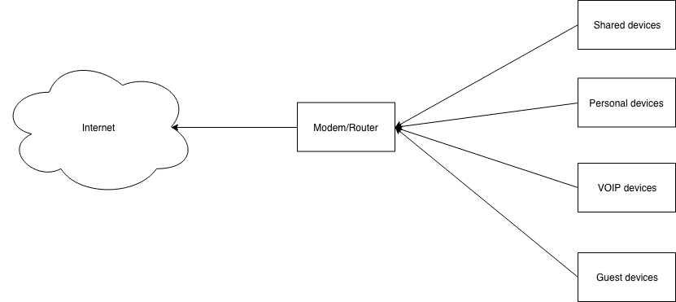
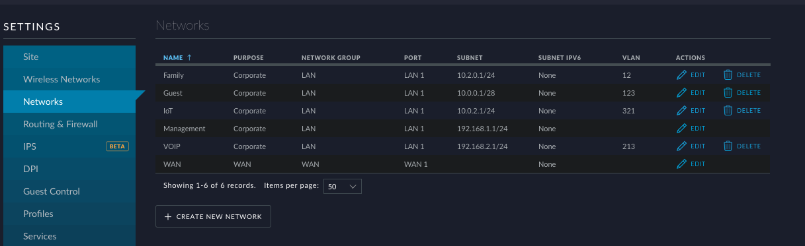
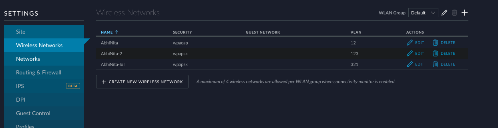
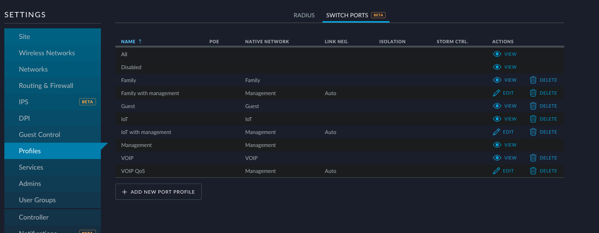
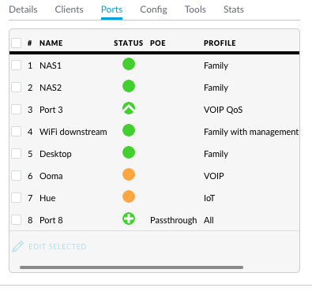
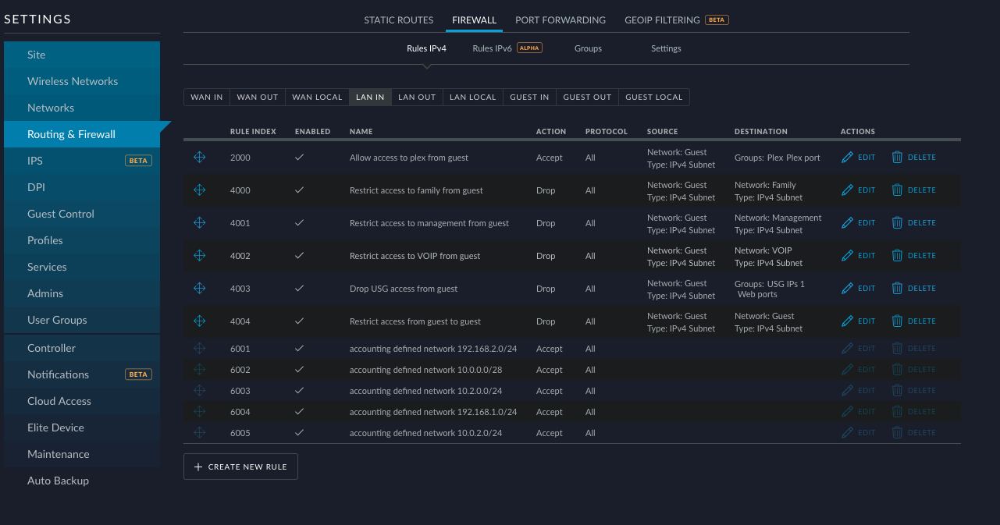
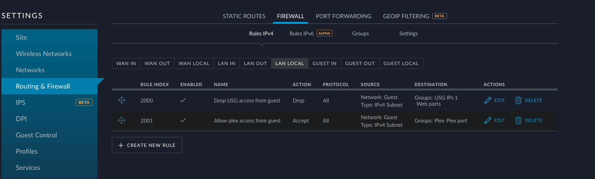
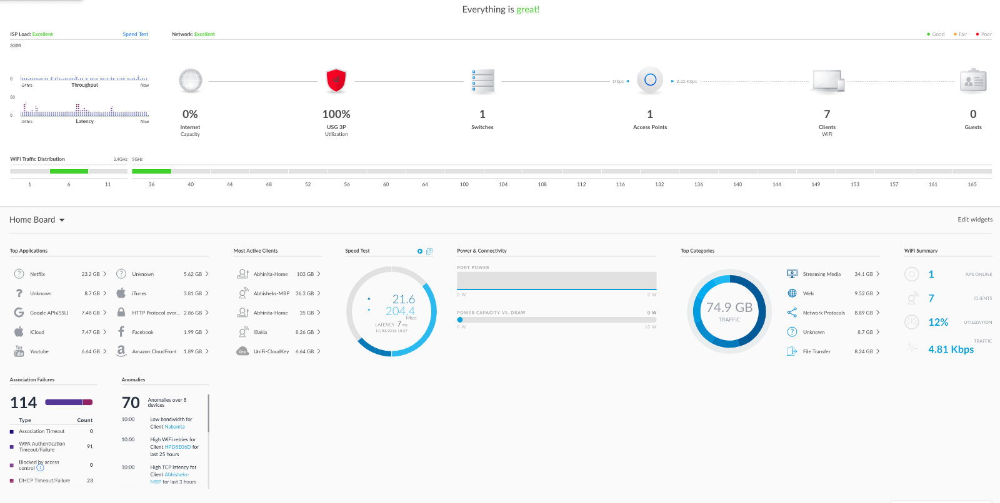
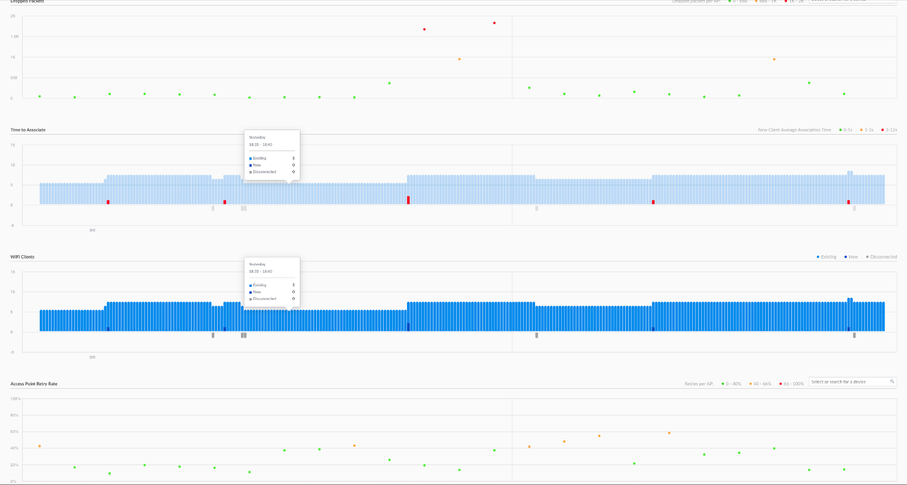

The first router I purchased was a cheap TP-Link one, supported only the 2.4GHz band, had minimal configurable options and was just that: a cheap consumer grade router. Not saying it was terrible, in fact, it served its purpose pretty well. Internet speeds were much slower then, RF environments were less noisy, and WiFi throughput was not a significant concern. Fast forward many years, and we have all those, and more problems now.

So, I started re-thinking our home network with hopes of building a more scalable and customizable one.

# Choosing the gear
I wanted to go with enterprise gear and after some search landed on Ubiquiti’s Unifi line of products primarily because they are

1. Easy to set up.
2. Provide a lot of customization if interested/required.
3. Very reliable.
4. Easy to scale horizontally.
5. Cheaper than some other brands I was interested in.

# Mental model of our home network
We have these four broad categories of devices:

1. Shared devices like IoT lights, printers, etc.
2. Personal devices like phones and computers.
3. VOIP devices.
4. And guest devices.

Each category needed to have its subnet and traffic needed to be segregated between categories. Although on separate subnets, some devices needed to “see” and connect, e.g. computers to printers.

Apart from different subnets, I also wanted to set up different wireless networks for our family, IoT devices and guests. And also have WPA2 EAP authentication for the family network.

So the mental model ended up looking something like this: 

So the mental model ended up looking something like this: 

Looked pretty simple except I also wanted to consider these constraints:

1. I had budgeted for just the must-have devices (so no extra switches or access points).
2. Devices in each category could be over either a wired or wireless network.

Thus, I ended up buying these four Unifi devices:

1. A Unifi Security Gateway.
2. A 8–60W switch.
3. A UAP AC Pro and
4. A Unifi Cloud Key.

These four devices are the components that makeup a single consumer grade router. And that I think is vital when it comes to scaling horizontally. For instance, if I move from our 900ish sq ft apartment to a house tomorrow, I need to add another WiFi access point and not replace the whole setup or add band-aids like repeaters.

With the mental model and gear in place, I started setting up our network. Since I was using Ubiquiti gear, this section illustrates examples using the Unifi controller, but the general concepts should hold for all brands.

# A subnet for all
I decided to create a network for each category of devices and also separate the management VLAN because:

1. It’s easier to create firewall rules between each category of devices if they were separated into different networks. Creating firewall rules based on IP addresses seemed brittle to me.
2. With different subnets, I can slap VLAN tags on each one of them and then reuse the same tags for my switch’s port configuration. Then devices of the same category using both wired and wireless networks will still be in the same subnet.

Thus, my set of subnets ended up looking something like this:

Note the VLAN tags in the third right column, those will come in very handy later.

# Give me WiFi
What’s a home network without WiFi. As mentioned earlier, I wanted to set up three wireless networks for these three categories of devices: personal, IoT and guest. My VoIP devices are all wired; hence, it’s excluded.

Why separate wireless networks?

1. So I can tweak rate and beacon controls. Our personal devices are relatively new and work on higher bitrates whereas some of our IoT devices don’t. And I didn’t want to guess for the guest devices. With separate networks, I have the option to set the network for our personal devices to higher bitrates than the other two.
2. Tag VLAN’s — this is an important one, IMO. Each of our wireless networks has VLAN’s tagged to it, which essentially categorizes them into one of the four logical categories of devices.

# Give me wired access too
I wanted to categorize wired clients the same way as wireless clients per the mental model. Unifi supports port profiles: a simple way of assigning networks or VLAN’s to each port. Internally, when a profile is assigned to a port, the switch will allow only traffic from that network and VLAN’s with allowed tags to pass through.

Thus, I created a few port profiles depending on the set of my wired clients 

And the rest was just assigning the profiles to ports.

# Limiting access
That was our basic network setup, but as you can imagine, it was too open. Guests could have potentially accessed personal devices and so on. Thus, as a security/peace of mind mechanism, I decided to put in some firewall rules.

Some of the rules below were created by Unifi, others manually added.

And that was it, a basic home network setup.

# Metrics and monitoring
One of the things I adore about the Unifi eco-system is its rich set of metrics. I won’t go into details of it but to entice you, this is how my dashboard looks (pretty cool, huh):

And with that I will leave you to model your home network. Happy tweaking!